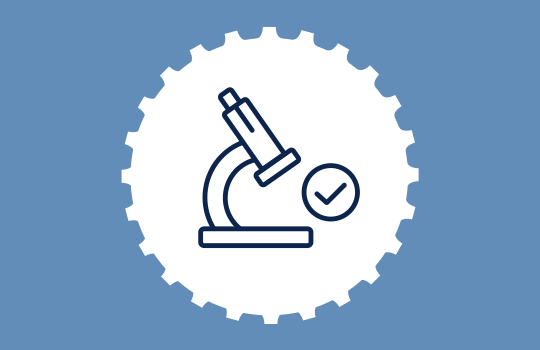

# Certifications & Research Learning Repository  
### by Naman Dixit 

## Repository Overview  
This repository consolidates my **certifications**, **research trainings**, and **learning achievements** in the fields of **Artificial Intelligence (AI)**, **Machine Learning (ML)**, **Deep Learning (DL)**, and **Data Science (DS)**.  
It serves as a structured archive and professional reference of coursework, institutional certifications, and technical mastery obtained from global leaders such as **Google**, **Microsoft**, **NASA**, **Amazon**, **IIIT Kota**, **ISRO**, **J.P. Morgan**, **Goldman Sachs**, and **NVIDIA**.

Each certification demonstrates my continuous learning and applied research interests in advancing intelligent systems, data-driven insights, and scalable engineering solutions.

---

## Repository Contents  
Inside this repository you will find:

- **Individual Folders** for each institution or provider (e.g., `Google/`, `Microsoft/`, `NASA/`, `NVIDIA/`)  
- **Certification Documents** (PDF or image) with metadata — title, issuing authority, date, credential ID, and link to verify (if available)  
- **Program Summaries** describing the content and relevance of each certification  
- **Technical Competency Tags** (AI / ML / DL / DS / Cloud / Research Engineering) for indexing

---

## Institutional Certifications & Descriptions  

| Institution | Programme / Certification | Description |
|--------------|---------------------------|--------------|
| **Google** | *Google AI / TensorFlow Developer / Data Analytics Professional* | Comprehensive training on AI & ML principles, TensorFlow frameworks, and data analytics workflows for production-level systems. |
| **Microsoft** | *Azure AI Engineer Associate / Data Scientist Associate / AI Fundamentals* | Industry-recognized certifications focusing on AI infrastructure, cloud deployment, and responsible machine learning on Azure. |
| **NASA** | *NASA Space Apps Challenge / AI & Data Science Research Program* | Engaged in research-based learning combining space data analytics and AI-driven modeling, emphasizing computational research and innovation. |
| **Amazon (AWS)** | *AWS Machine Learning Specialty / Data Analytics Certification* | Specialization in deploying machine learning workloads and automating data pipelines using AWS cloud ecosystem. |
| **IIIT Kota** | *AI & ML Research Internship / Academic Certification* | Participated in research-oriented modules and applied engineering projects at IIIT Kota focusing on neural networks and data intelligence. |
| **ISRO** | *ISRO-IRISET AI & Remote Sensing Certification* | Exposure to satellite imagery analysis, computer vision, and AI applications in space research through ISRO's learning initiative. |
| **J.P. Morgan** | *Software Engineering & Data Science Virtual Experience* | Completed hands-on modules on financial data analytics, API integration, and machine learning for quantitative insights. |
| **Goldman Sachs** | *Engineering Virtual Internship / Data Science Program* | Learned cybersecurity fundamentals, financial analytics, and data governance in applied engineering settings. |
| **NVIDIA** | *NVIDIA Deep Learning Institute (DLI) Certifications* | Completed specialized tracks in deep learning, computer vision, and generative AI using NVIDIA CUDA and TensorRT frameworks. |

---

## Technical Domains Covered  

- Artificial Intelligence (AI)  
- Machine Learning (ML)  
- Deep Learning (DL)  
- Data Science (DS)  
- Cloud Computing & Infrastructure (Azure, AWS, Google Cloud)  
- Applied Research & Computational Modelling  
- Computer Vision, NLP, and Generative AI  

---

## Structure of This Repository  

Each sub-folder contains:
- Certification document(s)  
- Description of course content & key learnings  
- Verification or credential links  
- Summary of relevance to current research or practice  

---

## Key Outcomes  

- Developed interdisciplinary expertise across AI, ML, DL, and Data Science.  
- Gained practical exposure to cloud-based AI development and computational modeling.  
- Enhanced research and analytical capabilities through NASA & ISRO certified programs.  
- Built strong foundations in AI ethics, responsible deployment, and data governance.  
- Connected with leading academic and industrial institutions shaping AI research globally.  

---

## Future Learning Roadmap  

- Continue specialization in **Generative AI Systems** and **Responsible AI Deployment**.  
- Engage in **Advanced NVIDIA DLI** and **Microsoft Research** tracks.  
- Pursue **doctoral-level coursework** or **research collaborations** around AI for space, finance, and healthcare.  
- Expand repository with research papers, projects, and conference participation.  

---

> _“Continuous learning is the foundation of continuous innovation.”_  
> — Naman Dixit

---

**This repository reflects verified certifications, academic collaborations, and applied research experiences in Artificial Intelligence and Data Science, consolidated for professional and academic reference.**
